# comment-analysis
A simple natural language processing model that analysis the toxicity of the comment from the database.

---

## Overview
> The project aims to build a multi-headed model that’s capable of detecting different types of of toxicity like threats, obscenity, insults, and identity-based hate, we will use a dataset of comments from Wikipedia’s talk page edits, collected by Kaggle. Improvements to the current model will hopefully help online discussion become more productive and respectful.

## Installation steps:
* Requirements:
    * python 3.x
    * basic ML libraries (see *requirements.txt*)
    * dataset: [kaggle](https://www.kaggle.com/c/jigsaw-toxic-comment-classification-challenge/data?select=train.csv.zip)

* installation:
```
python -m pip install --upgrade pip
pipenv shell
.\Scripts\activate

pip install -r requirements.txt
```

* Run the base file: `main.py`
```
python main.py
```

---

## Data Preprocessing and Exploratory Data Analysis
* Data Loading
```
train = pd.read_csv("data/train.csv")
test = pd.read_csv("data/test.csv")
test_y = pd.read_csv("data/test_labels.csv")
```
* Data Analysis
<div>
<table border="1" class="dataframe">
    <caption> <b>train.head</b> </caption>
  <thead>
    <tr style="text-align: right;">
      <th></th>
      <th>id</th>
      <th>comment_text</th>
      <th>toxic</th>
      <th>severe_toxic</th>
      <th>obscene</th>
      <th>threat</th>
      <th>insult</th>
      <th>identity_hate</th>
    </tr>
  </thead>
  <tbody>
    <tr>
      <th>0</th>
      <td>0000997932d777bf</td>
      <td>Explanation\nWhy the edits made under my usern...</td>
      <td>0</td>
      <td>0</td>
      <td>0</td>
      <td>0</td>
      <td>0</td>
      <td>0</td>
    </tr>
    <tr>
      <th>1</th>
      <td>000103f0d9cfb60f</td>
      <td>D'aww! He matches this background colour I'm s...</td>
      <td>0</td>
      <td>0</td>
      <td>0</td>
      <td>0</td>
      <td>0</td>
      <td>0</td>
    </tr>
    <tr>
      <th>2</th>
      <td>000113f07ec002fd</td>
      <td>Hey man, I'm really not trying to edit war. It...</td>
      <td>0</td>
      <td>0</td>
      <td>0</td>
      <td>0</td>
      <td>0</td>
      <td>0</td>
    </tr>
    <tr>
      <th>3</th>
      <td>0001b41b1c6bb37e</td>
      <td>"\nMore\nI can't make any real suggestions on ...</td>
      <td>0</td>
      <td>0</td>
      <td>0</td>
      <td>0</td>
      <td>0</td>
      <td>0</td>
    </tr>
    <tr>
      <th>4</th>
      <td>0001d958c54c6e35</td>
      <td>You, sir, are my hero. Any chance you remember...</td>
      <td>0</td>
      <td>0</td>
      <td>0</td>
      <td>0</td>
      <td>0</td>
      <td>0</td>
    </tr>
  </tbody>
</table>
</div>

<div>
<table border="1" class="dataframe">
    <caption> <b>train.describe</b> </caption>
  <thead>
    <tr style="text-align: right;">
      <th></th>
      <th>id</th>
      <th>comment_text</th>
      <th>toxic</th>
      <th>severe_toxic</th>
      <th>obscene</th>
      <th>threat</th>
      <th>insult</th>
      <th>identity_hate</th>
    </tr>
  </thead>
  <tbody>
    <tr>
      <th>0</th>
      <td>0000997932d777bf</td>
      <td>Explanation\nWhy the edits made under my usern...</td>
      <td>0</td>
      <td>0</td>
      <td>0</td>
      <td>0</td>
      <td>0</td>
      <td>0</td>
    </tr>
    <tr>
      <th>1</th>
      <td>000103f0d9cfb60f</td>
      <td>D'aww! He matches this background colour I'm s...</td>
      <td>0</td>
      <td>0</td>
      <td>0</td>
      <td>0</td>
      <td>0</td>
      <td>0</td>
    </tr>
    <tr>
      <th>2</th>
      <td>000113f07ec002fd</td>
      <td>Hey man, I'm really not trying to edit war. It...</td>
      <td>0</td>
      <td>0</td>
      <td>0</td>
      <td>0</td>
      <td>0</td>
      <td>0</td>
    </tr>
    <tr>
      <th>3</th>
      <td>0001b41b1c6bb37e</td>
      <td>"\nMore\nI can't make any real suggestions on ...</td>
      <td>0</td>
      <td>0</td>
      <td>0</td>
      <td>0</td>
      <td>0</td>
      <td>0</td>
    </tr>
    <tr>
      <th>4</th>
      <td>0001d958c54c6e35</td>
      <td>You, sir, are my hero. Any chance you remember...</td>
      <td>0</td>
      <td>0</td>
      <td>0</td>
      <td>0</td>
      <td>0</td>
      <td>0</td>
    </tr>
  </tbody>
</table>
</div>


<div>
<table border="1" class="dataframe">
    <caption> <b>test.head</b> </caption>
  <thead>
    <tr style="text-align: right;">
      <th></th>
      <th>id</th>
      <th>comment_text</th>
    </tr>
  </thead>
  <tbody>
    <tr>
      <th>0</th>
      <td>00001cee341fdb12</td>
      <td>Yo bitch Ja Rule is more succesful then you'll...</td>
    </tr>
    <tr>
      <th>1</th>
      <td>0000247867823ef7</td>
      <td>== From RfC == \n\n The title is fine as it is...</td>
    </tr>
    <tr>
      <th>2</th>
      <td>00013b17ad220c46</td>
      <td>" \n\n == Sources == \n\n * Zawe Ashton on Lap...</td>
    </tr>
    <tr>
      <th>3</th>
      <td>00017563c3f7919a</td>
      <td>:If you have a look back at the source, the in...</td>
    </tr>
    <tr>
      <th>4</th>
      <td>00017695ad8997eb</td>
      <td>I don't anonymously edit articles at all.</td>
    </tr>
  </tbody>
</table>
</div>


<div>
<table border="1" class="dataframe">
    <caption> <b>test_y.head</b> </caption>
  <thead>
    <tr style="text-align: right;">
      <th></th>
      <th>id</th>
      <th>toxic</th>
      <th>severe_toxic</th>
      <th>obscene</th>
      <th>threat</th>
      <th>insult</th>
      <th>identity_hate</th>
    </tr>
  </thead>
  <tbody>
    <tr>
      <th>0</th>
      <td>00001cee341fdb12</td>
      <td>-1</td>
      <td>-1</td>
      <td>-1</td>
      <td>-1</td>
      <td>-1</td>
      <td>-1</td>
    </tr>
    <tr>
      <th>1</th>
      <td>0000247867823ef7</td>
      <td>-1</td>
      <td>-1</td>
      <td>-1</td>
      <td>-1</td>
      <td>-1</td>
      <td>-1</td>
    </tr>
    <tr>
      <th>2</th>
      <td>00013b17ad220c46</td>
      <td>-1</td>
      <td>-1</td>
      <td>-1</td>
      <td>-1</td>
      <td>-1</td>
      <td>-1</td>
    </tr>
    <tr>
      <th>3</th>
      <td>00017563c3f7919a</td>
      <td>-1</td>
      <td>-1</td>
      <td>-1</td>
      <td>-1</td>
      <td>-1</td>
      <td>-1</td>
    </tr>
    <tr>
      <th>4</th>
      <td>00017695ad8997eb</td>
      <td>-1</td>
      <td>-1</td>
      <td>-1</td>
      <td>-1</td>
      <td>-1</td>
      <td>-1</td>
    </tr>
  </tbody>
</table>
</div>

*Notice that the training data contains 159,571 observations with 8 columns and the test datat contains 153,164 observations with 2 columns.*

Below is the plot showing the comment length frequency. As noticed, most of the comments are short with only a few comments longer than 1000 words.


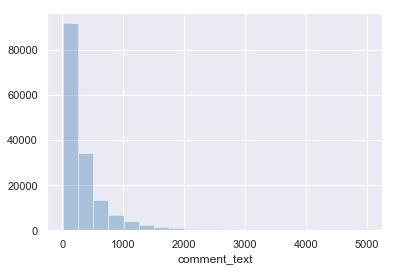


Further exploratory shows that label `toxic` has the most observations in the training dataset while `threat` has the least.

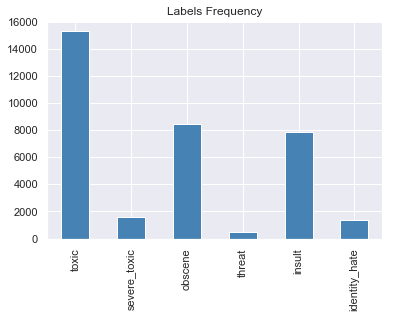


Below is the plot for the labeled data frequency. There is significant class imbalance since majority of the comments are considered non-toxic.

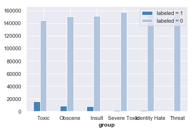


*It might be a great practice to see which labels are likely to appear together with a comment.*

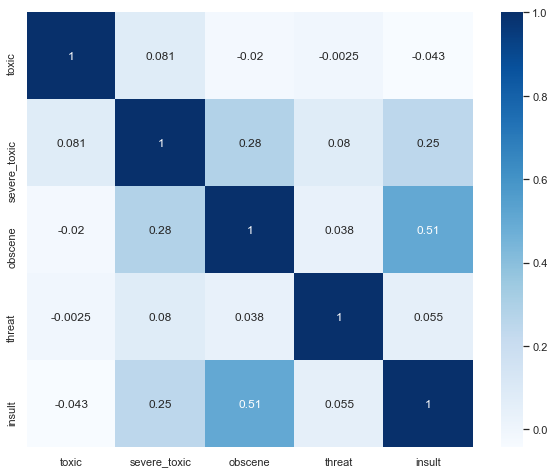

* As seen in the cross-correlation matrix, there is a high chance of obscene comments to be insulting.

* In order to get an idea of what are the words that contribute the most to different labels, we write a function to generate **word clouds**. The function takes in a parameter label (i.e., toxic, insult, threat, etc)

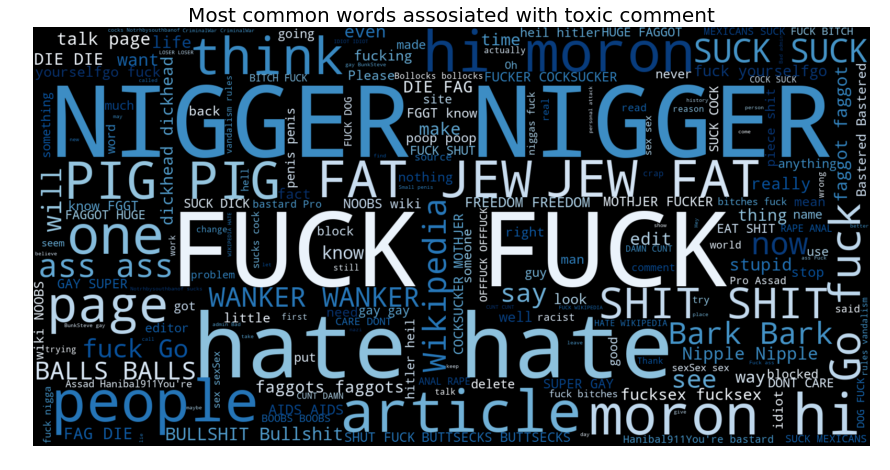

---

## Feature Engineering
Before fitting models, we need to break down the sentence into *unique words* by *tokenizing* the comments. In the `tokenize()` function, we remove punctuations and special characters. We also filtered out non-ascii characters after observing the results of feature engineering. We then *lemmatize* the comments and filter out comments with length below 3. Besides lemmatization, we also tried *stemming* but did not get a better result.

* benchmarking different vectorizers
    - We determined to use **TFIDF** to scale down the impact of tokens that occur very frequently in a given corpus and that are hence *empirically less informative* than features that occur in a small fraction of the training corpus.

    - Besides TFIDF, we also tried **CountVectorizer**. However, it is not performing as well as TFIDF. The TfidfVectorizer is actually CountVectorizer followed by TfidfTransformer. *TfidfTransformer transforms a count matrix to a normalized Term-Frequency or TermFrequency-InverseDocumentFrequency representation.* The goal of using tf-idf instead of the raw frequencies of occurrence of a token in a given document is to *scale down the impact of tokens that occur very frequently* in a given corpus and that are hence empirically less informative than features that occur in a small fraction of the training corpus. That's why we can improve the accuracy here.

    - For example: Since this corpus consists of data from the Wikipedia's talk page edits, the words such as wiki, Wikipedia, edit, page are very common. But for our classification purposes they do not provide us useful information and that should probably be the reason why TFIDF worked better than CountVectorizer.

---

## Modeling and Evaluation
### Baseline Model
We choose ***Naive Bayes*** as our baseline model, specifically *Multinomial Naive Bayes.*

Also, we want to *compare between different models*, especially models that perform well in text classification. Thus, we choose to compare *Multinomial Naive Bayes with Logistic Regression and Linear Support Vector Machine.*

### Evaluation Metrics
Our main metric for measuring model performance is **F1-score**, since we have 6 labels, the F1-score would be the average of 6 labels. We will also take other metrics into consideration while evaluating models, e.g, *Hamming loss and recall.*

### Cross Validation
We use **Cross Validation** to compare between the baseline model and the other two models that we have chosen *(LogisticRegression and LinearSVC).*


<div>
<table border="1" class="dataframe">
  <thead>
    <tr style="text-align: right;">
      <th></th>
      <th>Model</th>
      <th>Label</th>
      <th>Recall</th>
      <th>F1</th>
    </tr>
  </thead>
  <tbody>
    <tr>
      <th>0</th>
      <td>MultinomialNB</td>
      <td>toxic</td>
      <td>0.483066</td>
      <td>0.636650</td>
    </tr>
    <tr>
      <th>1</th>
      <td>MultinomialNB</td>
      <td>severe_toxic</td>
      <td>0.021336</td>
      <td>0.041091</td>
    </tr>
    <tr>
      <th>6</th>
      <td>LogisticRegression</td>
      <td>toxic</td>
      <td>0.610500</td>
      <td>0.731340</td>
    </tr>
    <tr>
      <th>7</th>
      <td>LogisticRegression</td>
      <td>severe_toxic</td>
      <td>0.256395</td>
      <td>0.351711</td>
    </tr>
    <tr>
      <th>12</th>
      <td>LinearSVC</td>
      <td>toxic</td>
      <td>0.680528</td>
      <td>0.759304</td>
    </tr>
    <tr>
      <th>13</th>
      <td>LinearSVC</td>
      <td>severe_toxic</td>
      <td>0.267693</td>
      <td>0.355258</td>
    </tr>
  </tbody>
</table>
</div>

Based on the cross validation above the *linear SVC model and Logistic Regression model perform better.* As a baseline model, Multinomial Naive Bayes does not perform well, especially for the `threat` label and `identity_hate` label because these two labels have the least number of observations.

Determinig the models' performance on the actual prediction - the test dataset.

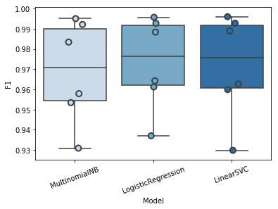

Above are the result table and plot showing a comparison between these different models after training.

Notice that Muninomial Naive Bayes does not perform as well as the other two models while Linear SVC in general out performs the others based on F1 score.

---

## Vizualizing Performance
Visualizing performance till now for each classifier across each cateogry

### F1 and recall

<div>
<p align="center"> Mulitnomial Naive Bayes regression </p>

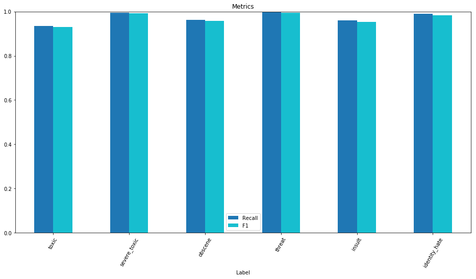
</div>

<div>
<p align="center"> Logistic regression </p>

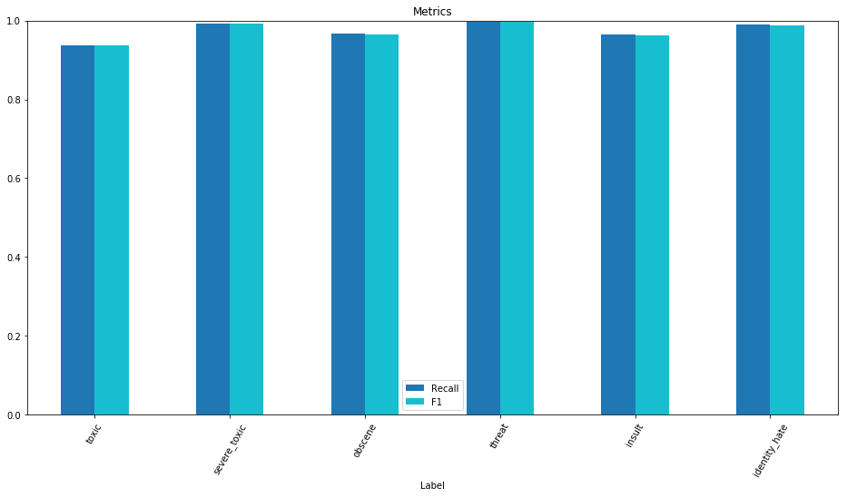
</div>

<div>
<p align="center"> Linear SVC </p>

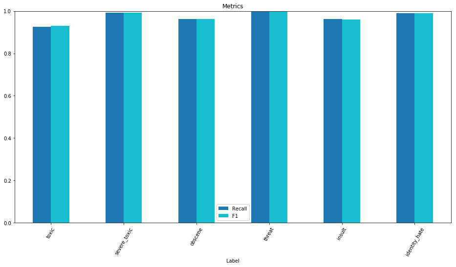
</div>

### Confusion Matrix


<div>
<p align="center"> Mulitnomial Naive Bayes regression </p>

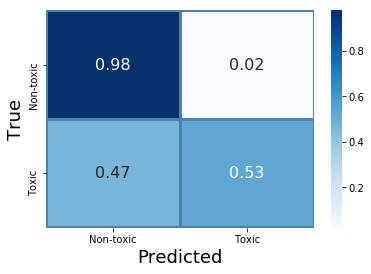
</div>

<div>
<p align="center"> Logistic regression </p>

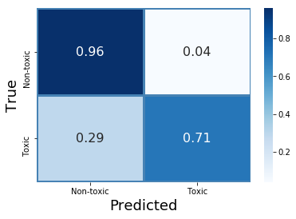
</div>

<div>
<p align="center"> Linear SVC </p>

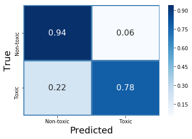
</div>


Based on the above comparison, we could say that for these three models with default settings, **LinearSVC performs better than anyone for 'toxic' label .**


### Aggregated Hamming Loss Score

<div>
<table border="1" class="dataframe">
  <thead>
    <tr style="text-align: right;">
      <th></th>
      <th>Model</th>
      <th>Hamming_Loss</th>
    </tr>
  </thead>
  <tbody>
    <tr>
      <th>0</th>
      <td>MultinomialNB</td>
      <td>0.026939</td>
    </tr>
    <tr>
      <th>1</th>
      <td>LogisticRegression</td>
      <td>0.025675</td>
    </tr>
    <tr>
      <th>2</th>
      <td>LinearSVC</td>
      <td>0.028476</td>
    </tr>
  </tbody>
</table>
</div>

Across all models , **Logistic Regression** is doing a great job overall since it has the lowest percentage of incorrect labels.


### Pipelines
Clean the code with pipeline and use some manually chosen hyperparameters to check how each model behaves. 
Manually adjusting `class_weight` for the models to determine if we can achieve better results.

Since Logistic Regression and Linear SVM are performing better, we will focus on these two models. For display purpose, we will only include average F1 score, Recall, and Hamming Loss for comparison.

- Notice that after adjusting `class_weight`, we are getting way better results than the basic models. LinearSVC outperforms LogisticRegression by approximately 1%.

<div>
<table border="1" class="dataframe">
  <thead>
    <tr style="text-align: right;">
      <th></th>
      <th>Model</th>
      <th>F1</th>
      <th>Recall</th>
      <th>Hamming_Loss</th>
      <th>Training_Time</th>
    </tr>
  </thead>
  <tbody>
    <tr>
      <th>0</th>
      <td>LogisticRegression</td>
      <td>0.947921</td>
      <td>0.934050</td>
      <td>0.065950</td>
      <td>2.137849</td>
    </tr>
    <tr>
      <th>1</th>
      <td>LinearSVC</td>
      <td>0.951508</td>
      <td>0.941634</td>
      <td>0.058366</td>
      <td>7.478050</td>
    </tr>
  </tbody>
</table>
</div>

---

## Hyperparameter Tuning with Grid Search
We decide to do grid search to seek for the *"optimal"* hyperparameters for the basic models that we've chose. Later we will make comparison based on the best model from each algorithm, since we have 6 different lables, tuning models for each label would be time expensive, so we will use the *most common label ***"Toxic"*** to tune hyperparameters.*

### Model Selection
We will then compare these two models based on their tunned hyperparameters, we will also include training time as one of the metric when we compare models.

<div>
<table border="1" class="dataframe">
  <thead>
    <tr style="text-align: right;">
      <th></th>
      <th>Model</th>
      <th>F1</th>
      <th>Recall</th>
      <th>Hamming_Loss</th>
      <th>Traing_Time</th>
    </tr>
  </thead>
  <tbody>
    <tr>
      <th>0</th>
      <td>LinearSVC</td>
      <td>0.971706</td>
      <td>0.971524</td>
      <td>0.028476</td>
      <td>5.029654</td>
    </tr>
    <tr>
      <th>1</th>
      <td>LogisticRegression</td>
      <td>0.973227</td>
      <td>0.974330</td>
      <td>0.025670</td>
      <td>13.031119</td>
    </tr>
  </tbody>
</table>
</div>


## Ensembling
Since Ensemble learning helps improve machine learning results by combining several models and allows the production of better predictive performance compared to a single model.
> Testing if ensembling helps us achieve better results. 

To ensemble different models, we firstly tried some models based on tree boosting, then use a voting classfier to ensemble one of the boosting model with the basic models in previous parts.

### Boosting Models
Comparing 3 popular boosting models:
        - Adaboost
        - GradientBoost
        - XgBoost

- Score after boosting the models:

<div>
<table border="1" class="dataframe">
  <thead>
    <tr style="text-align: right;">
      <th></th>
      <th>Model</th>
      <th>F1</th>
      <th>Recall</th>
      <th>Hamming_Loss</th>
      <th>Traing_Time</th>
    </tr>
  </thead>
  <tbody>
    <tr>
      <th>0</th>
      <td>AdaBoostClassifier</td>
      <td>0.967605</td>
      <td>0.969771</td>
      <td>0.030229</td>
      <td>50.761416</td>
    </tr>
    <tr>
      <th>1</th>
      <td>GradientBoostingClassifier</td>
      <td>0.969075</td>
      <td>0.971748</td>
      <td>0.028252</td>
      <td>204.453572</td>
    </tr>
    <tr>
      <th>2</th>
      <td>XGBClassifier</td>
      <td>0.967563</td>
      <td>0.971790</td>
      <td>0.028210</td>
      <td>68.613414</td>
    </tr>
  </tbody>
</table>
</div>


Since *gradient boosting outperforms other two* boosting models, we decide to go ahead with ***gradient boosting***.

### Voting Classifier
Ensembled model worked very well but still ***could not outperform*** LinearSVC since we did not tune the hyperparameters for the ensemled model.

<div>
<table border="1" class="dataframe">
  <thead>
    <tr style="text-align: right;">
      <th></th>
      <th>Model</th>
      <th>F1</th>
      <th>Recall</th>
      <th>Hamming_Loss</th>
      <th>Training_Time</th>
    </tr>
  </thead>
  <tbody>
    <tr>
      <th>0</th>
      <td>Ensemble</td>
      <td>0.973026</td>
      <td>0.974119</td>
      <td>0.025881</td>
      <td>64.728463</td>
    </tr>
  </tbody>
</table>
</div>


## Result Interpretation

* What went wrong:
    - Analyzing the words misclassified by Logistic Classifier. Checking for 'toxic' label

    - Misclassified 1347 as non-toxic which were actually toxic

    - 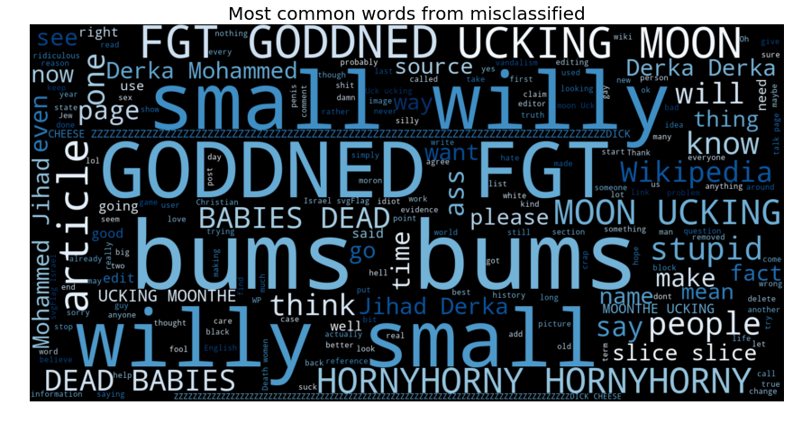

    - We want to analyze why the model couldn't recognize these words. Were they not present in the training set? 
    
    - In order to analyze, we first need to pass these raw comment strings through same tokenizer and check the common tokens.

* `ucking` is a common word in the test set and it seems our classifier hasnt learnt to classify it as toxic. 

* This token wasn't common in our training set. That explains why our model couldn't learn it. 


### Learning Models visualization

Plot learning rate curve for the estimator with title, training data as X, 
labels as y.

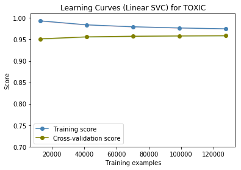

---

## Future Improvements
 - Try more ways of vectorizing text data.
 - Go deeper on feature engineering : Spelling corrector, Sentiment scores, n-grams, etc.
 - Advanced models (e.g., lightgbm).
 - Advanced Ensemble model (e.g., stacking).
 - Deep learning model (e.g., LSTM).
 - Advanced hyperparameter tuning techniques (e.g., Bayesian Optimization).

---

## References:
1. https://www.kaggle.com/c/jigsaw-toxic-comment-classification-challenge

2. https://github.com/nicknochnack/CommentToxicity

3. https://youtu.be/ZUqB-luawZg?feature=shared