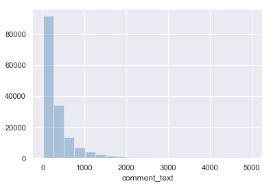
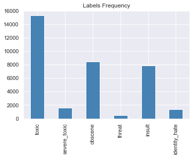
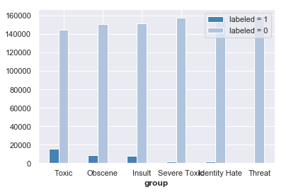
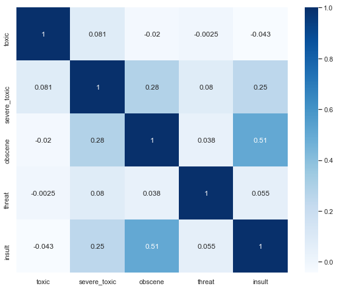
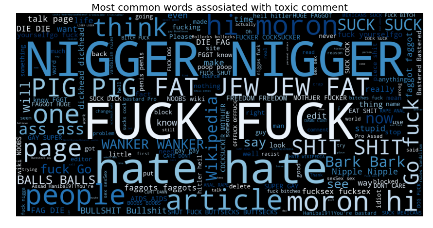

# comment-analysis
A simple natural language processing model that analysis the toxicity of the comment from the database.

---

## Overview
> The project aims to build a multi-headed model that’s capable of detecting different types of of toxicity like threats, obscenity, insults, and identity-based hate, we will use a dataset of comments from Wikipedia’s talk page edits, collected by Kaggle. Improvements to the current model will hopefully help online discussion become more productive and respectful.

## Data Preprocessing and Exploratory Data Analysis
* Data Loading
```
train = pd.read_csv("data/train.csv")
test = pd.read_csv("data/test.csv")
test_y = pd.read_csv("data/test_labels.csv")
```
* Data Analysis
<div>
<style scoped>
    
    .dataframe tbody tr th:only-of-type {
        vertical-align: middle;
    }

    .dataframe tbody tr th {
        vertical-align: top;
    }

    .dataframe thead th {
        text-align: right;
    }
</style>

<table border="1" class="dataframe">
    <caption> <b>train.head</b> </caption>
  <thead>
    <tr style="text-align: right;">
      <th></th>
      <th>id</th>
      <th>comment_text</th>
      <th>toxic</th>
      <th>severe_toxic</th>
      <th>obscene</th>
      <th>threat</th>
      <th>insult</th>
      <th>identity_hate</th>
    </tr>
  </thead>
  <tbody>
    <tr>
      <th>0</th>
      <td>0000997932d777bf</td>
      <td>Explanation\nWhy the edits made under my usern...</td>
      <td>0</td>
      <td>0</td>
      <td>0</td>
      <td>0</td>
      <td>0</td>
      <td>0</td>
    </tr>
    <tr>
      <th>1</th>
      <td>000103f0d9cfb60f</td>
      <td>D'aww! He matches this background colour I'm s...</td>
      <td>0</td>
      <td>0</td>
      <td>0</td>
      <td>0</td>
      <td>0</td>
      <td>0</td>
    </tr>
    <tr>
      <th>2</th>
      <td>000113f07ec002fd</td>
      <td>Hey man, I'm really not trying to edit war. It...</td>
      <td>0</td>
      <td>0</td>
      <td>0</td>
      <td>0</td>
      <td>0</td>
      <td>0</td>
    </tr>
    <tr>
      <th>3</th>
      <td>0001b41b1c6bb37e</td>
      <td>"\nMore\nI can't make any real suggestions on ...</td>
      <td>0</td>
      <td>0</td>
      <td>0</td>
      <td>0</td>
      <td>0</td>
      <td>0</td>
    </tr>
    <tr>
      <th>4</th>
      <td>0001d958c54c6e35</td>
      <td>You, sir, are my hero. Any chance you remember...</td>
      <td>0</td>
      <td>0</td>
      <td>0</td>
      <td>0</td>
      <td>0</td>
      <td>0</td>
    </tr>
  </tbody>
</table>
</div>

<div>
<style>
    .dataframe tbody tr th:only-of-type {
        vertical-align: middle;
    }

    .dataframe tbody tr th {
        vertical-align: top;
    }

    .dataframe thead th {
        text-align: right;
    }
</style>
<table border="1" class="dataframe">
    <caption> <b>train.describe</b> </caption>
  <thead>
    <tr style="text-align: right;">
      <th></th>
      <th>id</th>
      <th>comment_text</th>
      <th>toxic</th>
      <th>severe_toxic</th>
      <th>obscene</th>
      <th>threat</th>
      <th>insult</th>
      <th>identity_hate</th>
    </tr>
  </thead>
  <tbody>
    <tr>
      <th>0</th>
      <td>0000997932d777bf</td>
      <td>Explanation\nWhy the edits made under my usern...</td>
      <td>0</td>
      <td>0</td>
      <td>0</td>
      <td>0</td>
      <td>0</td>
      <td>0</td>
    </tr>
    <tr>
      <th>1</th>
      <td>000103f0d9cfb60f</td>
      <td>D'aww! He matches this background colour I'm s...</td>
      <td>0</td>
      <td>0</td>
      <td>0</td>
      <td>0</td>
      <td>0</td>
      <td>0</td>
    </tr>
    <tr>
      <th>2</th>
      <td>000113f07ec002fd</td>
      <td>Hey man, I'm really not trying to edit war. It...</td>
      <td>0</td>
      <td>0</td>
      <td>0</td>
      <td>0</td>
      <td>0</td>
      <td>0</td>
    </tr>
    <tr>
      <th>3</th>
      <td>0001b41b1c6bb37e</td>
      <td>"\nMore\nI can't make any real suggestions on ...</td>
      <td>0</td>
      <td>0</td>
      <td>0</td>
      <td>0</td>
      <td>0</td>
      <td>0</td>
    </tr>
    <tr>
      <th>4</th>
      <td>0001d958c54c6e35</td>
      <td>You, sir, are my hero. Any chance you remember...</td>
      <td>0</td>
      <td>0</td>
      <td>0</td>
      <td>0</td>
      <td>0</td>
      <td>0</td>
    </tr>
  </tbody>
</table>
</div>


<div>
<style>
    .dataframe tbody tr th:only-of-type {
        vertical-align: middle;
    }

    .dataframe tbody tr th {
        vertical-align: top;
    }

    .dataframe thead th {
        text-align: right;
    }
</style>
<table border="1" class="dataframe">
    <caption> <b>test.head</b> </caption>
  <thead>
    <tr style="text-align: right;">
      <th></th>
      <th>id</th>
      <th>comment_text</th>
    </tr>
  </thead>
  <tbody>
    <tr>
      <th>0</th>
      <td>00001cee341fdb12</td>
      <td>Yo bitch Ja Rule is more succesful then you'll...</td>
    </tr>
    <tr>
      <th>1</th>
      <td>0000247867823ef7</td>
      <td>== From RfC == \n\n The title is fine as it is...</td>
    </tr>
    <tr>
      <th>2</th>
      <td>00013b17ad220c46</td>
      <td>" \n\n == Sources == \n\n * Zawe Ashton on Lap...</td>
    </tr>
    <tr>
      <th>3</th>
      <td>00017563c3f7919a</td>
      <td>:If you have a look back at the source, the in...</td>
    </tr>
    <tr>
      <th>4</th>
      <td>00017695ad8997eb</td>
      <td>I don't anonymously edit articles at all.</td>
    </tr>
  </tbody>
</table>
</div>


<div>
<style>
    .dataframe tbody tr th:only-of-type {
        vertical-align: middle;
    }

    .dataframe tbody tr th {
        vertical-align: top;
    }

    .dataframe thead th {
        text-align: right;
    }
</style>
<table border="1" class="dataframe">
    <caption> <b>test_y.head</b> </caption>
  <thead>
    <tr style="text-align: right;">
      <th></th>
      <th>id</th>
      <th>toxic</th>
      <th>severe_toxic</th>
      <th>obscene</th>
      <th>threat</th>
      <th>insult</th>
      <th>identity_hate</th>
    </tr>
  </thead>
  <tbody>
    <tr>
      <th>0</th>
      <td>00001cee341fdb12</td>
      <td>-1</td>
      <td>-1</td>
      <td>-1</td>
      <td>-1</td>
      <td>-1</td>
      <td>-1</td>
    </tr>
    <tr>
      <th>1</th>
      <td>0000247867823ef7</td>
      <td>-1</td>
      <td>-1</td>
      <td>-1</td>
      <td>-1</td>
      <td>-1</td>
      <td>-1</td>
    </tr>
    <tr>
      <th>2</th>
      <td>00013b17ad220c46</td>
      <td>-1</td>
      <td>-1</td>
      <td>-1</td>
      <td>-1</td>
      <td>-1</td>
      <td>-1</td>
    </tr>
    <tr>
      <th>3</th>
      <td>00017563c3f7919a</td>
      <td>-1</td>
      <td>-1</td>
      <td>-1</td>
      <td>-1</td>
      <td>-1</td>
      <td>-1</td>
    </tr>
    <tr>
      <th>4</th>
      <td>00017695ad8997eb</td>
      <td>-1</td>
      <td>-1</td>
      <td>-1</td>
      <td>-1</td>
      <td>-1</td>
      <td>-1</td>
    </tr>
  </tbody>
</table>
</div>

*Notice that the training data contains 159,571 observations with 8 columns and the test datat contains 153,164 observations with 2 columns.*

Below is the plot showing the comment length frequency. As noticed, most of the comments are short with only a few comments longer than 1000 words.





Further exploratory shows that label `toxic` has the most observations in the training dataset while `threat` has the least.




Below is the plot for the labeled data frequency. There is significant class imbalance since majority of the comments are considered non-toxic.




*It might be a great practice to see which labels are likely to appear together with a comment.*



* As seen in the cross-correlation matrix, there is a high chance of obscene comments to be insulting.

* In order to get an idea of what are the words that contribute the most to different labels, we write a function to generate **word clouds**. The function takes in a parameter label (i.e., toxic, insult, threat, etc)


