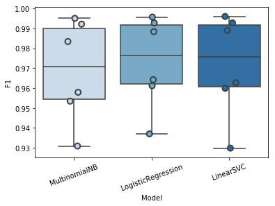
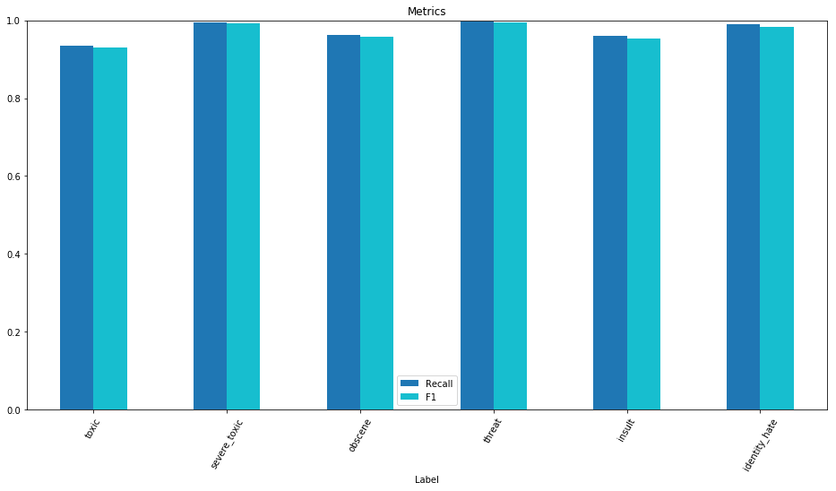
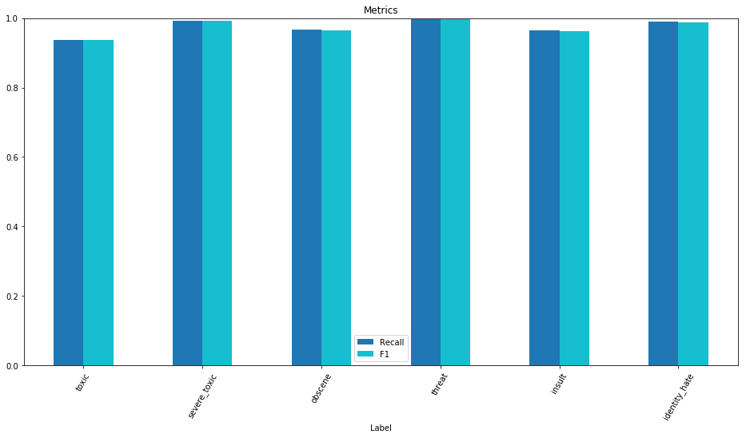
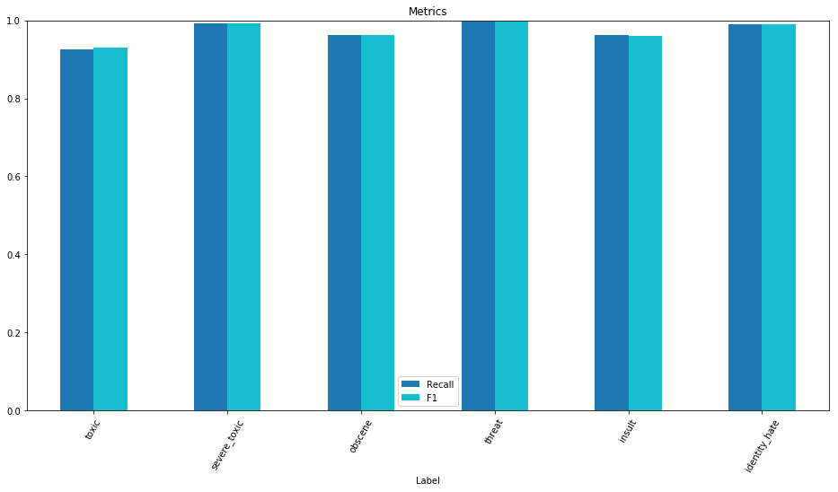

# comment-analysis
A simple natural language processing model that analysis the toxicity of the comment from the database.

---

## Overview
> The project aims to build a multi-headed model that’s capable of detecting different types of of toxicity like threats, obscenity, insults, and identity-based hate, we will use a dataset of comments from Wikipedia’s talk page edits, collected by Kaggle. Improvements to the current model will hopefully help online discussion become more productive and respectful.

## Data Preprocessing and Exploratory Data Analysis
* Data Loading
```
train = pd.read_csv("data/train.csv")
test = pd.read_csv("data/test.csv")
test_y = pd.read_csv("data/test_labels.csv")
```
* Data Analysis
<div>
<table border="1" class="dataframe">
    <caption> <b>train.head</b> </caption>
  <thead>
    <tr style="text-align: right;">
      <th></th>
      <th>id</th>
      <th>comment_text</th>
      <th>toxic</th>
      <th>severe_toxic</th>
      <th>obscene</th>
      <th>threat</th>
      <th>insult</th>
      <th>identity_hate</th>
    </tr>
  </thead>
  <tbody>
    <tr>
      <th>0</th>
      <td>0000997932d777bf</td>
      <td>Explanation\nWhy the edits made under my usern...</td>
      <td>0</td>
      <td>0</td>
      <td>0</td>
      <td>0</td>
      <td>0</td>
      <td>0</td>
    </tr>
    <tr>
      <th>1</th>
      <td>000103f0d9cfb60f</td>
      <td>D'aww! He matches this background colour I'm s...</td>
      <td>0</td>
      <td>0</td>
      <td>0</td>
      <td>0</td>
      <td>0</td>
      <td>0</td>
    </tr>
    <tr>
      <th>2</th>
      <td>000113f07ec002fd</td>
      <td>Hey man, I'm really not trying to edit war. It...</td>
      <td>0</td>
      <td>0</td>
      <td>0</td>
      <td>0</td>
      <td>0</td>
      <td>0</td>
    </tr>
    <tr>
      <th>3</th>
      <td>0001b41b1c6bb37e</td>
      <td>"\nMore\nI can't make any real suggestions on ...</td>
      <td>0</td>
      <td>0</td>
      <td>0</td>
      <td>0</td>
      <td>0</td>
      <td>0</td>
    </tr>
    <tr>
      <th>4</th>
      <td>0001d958c54c6e35</td>
      <td>You, sir, are my hero. Any chance you remember...</td>
      <td>0</td>
      <td>0</td>
      <td>0</td>
      <td>0</td>
      <td>0</td>
      <td>0</td>
    </tr>
  </tbody>
</table>
</div>

<div>
<table border="1" class="dataframe">
    <caption> <b>train.describe</b> </caption>
  <thead>
    <tr style="text-align: right;">
      <th></th>
      <th>id</th>
      <th>comment_text</th>
      <th>toxic</th>
      <th>severe_toxic</th>
      <th>obscene</th>
      <th>threat</th>
      <th>insult</th>
      <th>identity_hate</th>
    </tr>
  </thead>
  <tbody>
    <tr>
      <th>0</th>
      <td>0000997932d777bf</td>
      <td>Explanation\nWhy the edits made under my usern...</td>
      <td>0</td>
      <td>0</td>
      <td>0</td>
      <td>0</td>
      <td>0</td>
      <td>0</td>
    </tr>
    <tr>
      <th>1</th>
      <td>000103f0d9cfb60f</td>
      <td>D'aww! He matches this background colour I'm s...</td>
      <td>0</td>
      <td>0</td>
      <td>0</td>
      <td>0</td>
      <td>0</td>
      <td>0</td>
    </tr>
    <tr>
      <th>2</th>
      <td>000113f07ec002fd</td>
      <td>Hey man, I'm really not trying to edit war. It...</td>
      <td>0</td>
      <td>0</td>
      <td>0</td>
      <td>0</td>
      <td>0</td>
      <td>0</td>
    </tr>
    <tr>
      <th>3</th>
      <td>0001b41b1c6bb37e</td>
      <td>"\nMore\nI can't make any real suggestions on ...</td>
      <td>0</td>
      <td>0</td>
      <td>0</td>
      <td>0</td>
      <td>0</td>
      <td>0</td>
    </tr>
    <tr>
      <th>4</th>
      <td>0001d958c54c6e35</td>
      <td>You, sir, are my hero. Any chance you remember...</td>
      <td>0</td>
      <td>0</td>
      <td>0</td>
      <td>0</td>
      <td>0</td>
      <td>0</td>
    </tr>
  </tbody>
</table>
</div>


<div>
<table border="1" class="dataframe">
    <caption> <b>test.head</b> </caption>
  <thead>
    <tr style="text-align: right;">
      <th></th>
      <th>id</th>
      <th>comment_text</th>
    </tr>
  </thead>
  <tbody>
    <tr>
      <th>0</th>
      <td>00001cee341fdb12</td>
      <td>Yo bitch Ja Rule is more succesful then you'll...</td>
    </tr>
    <tr>
      <th>1</th>
      <td>0000247867823ef7</td>
      <td>== From RfC == \n\n The title is fine as it is...</td>
    </tr>
    <tr>
      <th>2</th>
      <td>00013b17ad220c46</td>
      <td>" \n\n == Sources == \n\n * Zawe Ashton on Lap...</td>
    </tr>
    <tr>
      <th>3</th>
      <td>00017563c3f7919a</td>
      <td>:If you have a look back at the source, the in...</td>
    </tr>
    <tr>
      <th>4</th>
      <td>00017695ad8997eb</td>
      <td>I don't anonymously edit articles at all.</td>
    </tr>
  </tbody>
</table>
</div>


<div>
<table border="1" class="dataframe">
    <caption> <b>test_y.head</b> </caption>
  <thead>
    <tr style="text-align: right;">
      <th></th>
      <th>id</th>
      <th>toxic</th>
      <th>severe_toxic</th>
      <th>obscene</th>
      <th>threat</th>
      <th>insult</th>
      <th>identity_hate</th>
    </tr>
  </thead>
  <tbody>
    <tr>
      <th>0</th>
      <td>00001cee341fdb12</td>
      <td>-1</td>
      <td>-1</td>
      <td>-1</td>
      <td>-1</td>
      <td>-1</td>
      <td>-1</td>
    </tr>
    <tr>
      <th>1</th>
      <td>0000247867823ef7</td>
      <td>-1</td>
      <td>-1</td>
      <td>-1</td>
      <td>-1</td>
      <td>-1</td>
      <td>-1</td>
    </tr>
    <tr>
      <th>2</th>
      <td>00013b17ad220c46</td>
      <td>-1</td>
      <td>-1</td>
      <td>-1</td>
      <td>-1</td>
      <td>-1</td>
      <td>-1</td>
    </tr>
    <tr>
      <th>3</th>
      <td>00017563c3f7919a</td>
      <td>-1</td>
      <td>-1</td>
      <td>-1</td>
      <td>-1</td>
      <td>-1</td>
      <td>-1</td>
    </tr>
    <tr>
      <th>4</th>
      <td>00017695ad8997eb</td>
      <td>-1</td>
      <td>-1</td>
      <td>-1</td>
      <td>-1</td>
      <td>-1</td>
      <td>-1</td>
    </tr>
  </tbody>
</table>
</div>

*Notice that the training data contains 159,571 observations with 8 columns and the test datat contains 153,164 observations with 2 columns.*

Below is the plot showing the comment length frequency. As noticed, most of the comments are short with only a few comments longer than 1000 words.


Further exploratory shows that label `toxic` has the most observations in the training dataset while `threat` has the least.


Below is the plot for the labeled data frequency. There is significant class imbalance since majority of the comments are considered non-toxic.


*It might be a great practice to see which labels are likely to appear together with a comment.*


* As seen in the cross-correlation matrix, there is a high chance of obscene comments to be insulting.

* In order to get an idea of what are the words that contribute the most to different labels, we write a function to generate **word clouds**. The function takes in a parameter label (i.e., toxic, insult, threat, etc)


---

## Feature Engineering
Before fitting models, we need to break down the sentence into *unique words* by *tokenizing* the comments. In the `tokenize()` function, we remove punctuations and special characters. We also filtered out non-ascii characters after observing the results of feature engineering. We then *lemmatize* the comments and filter out comments with length below 3. Besides lemmatization, we also tried *stemming* but did not get a better result.

* benchmarking different vectorizers
    - We determined to use **TFIDF** to scale down the impact of tokens that occur very frequently in a given corpus and that are hence *empirically less informative* than features that occur in a small fraction of the training corpus.

    - Besides TFIDF, we also tried **CountVectorizer**. However, it is not performing as well as TFIDF. The TfidfVectorizer is actually CountVectorizer followed by TfidfTransformer. *TfidfTransformer transforms a count matrix to a normalized Term-Frequency or TermFrequency-InverseDocumentFrequency representation.* The goal of using tf-idf instead of the raw frequencies of occurrence of a token in a given document is to *scale down the impact of tokens that occur very frequently* in a given corpus and that are hence empirically less informative than features that occur in a small fraction of the training corpus. That's why we can improve the accuracy here.

    - For example: Since this corpus consists of data from the Wikipedia's talk page edits, the words such as wiki, Wikipedia, edit, page are very common. But for our classification purposes they do not provide us useful information and that should probably be the reason why TFIDF worked better than CountVectorizer.

---

## Modeling and Evaluation
### Baseline Model
We choose ***Naive Bayes*** as our baseline model, specifically *Multinomial Naive Bayes.*

Also, we want to *compare between different models*, especially models that perform well in text classification. Thus, we choose to compare *Multinomial Naive Bayes with Logistic Regression and Linear Support Vector Machine.*

### Evaluation Metrics
Our main metric for measuring model performance is **F1-score**, since we have 6 labels, the F1-score would be the average of 6 labels. We will also take other metrics into consideration while evaluating models, e.g, *Hamming loss and recall.*

### Cross Validation
We use **Cross Validation** to compare between the baseline model and the other two models that we have chosen *(LogisticRegression and LinearSVC).*


<div>
<table border="1" class="dataframe">
  <thead>
    <tr style="text-align: right;">
      <th></th>
      <th>Model</th>
      <th>Label</th>
      <th>Recall</th>
      <th>F1</th>
    </tr>
  </thead>
  <tbody>
    <tr>
      <th>0</th>
      <td>MultinomialNB</td>
      <td>toxic</td>
      <td>0.483066</td>
      <td>0.636650</td>
    </tr>
    <tr>
      <th>1</th>
      <td>MultinomialNB</td>
      <td>severe_toxic</td>
      <td>0.021336</td>
      <td>0.041091</td>
    </tr>
    <tr>
      <th>6</th>
      <td>LogisticRegression</td>
      <td>toxic</td>
      <td>0.610500</td>
      <td>0.731340</td>
    </tr>
    <tr>
      <th>7</th>
      <td>LogisticRegression</td>
      <td>severe_toxic</td>
      <td>0.256395</td>
      <td>0.351711</td>
    </tr>
    <tr>
      <th>12</th>
      <td>LinearSVC</td>
      <td>toxic</td>
      <td>0.680528</td>
      <td>0.759304</td>
    </tr>
    <tr>
      <th>13</th>
      <td>LinearSVC</td>
      <td>severe_toxic</td>
      <td>0.267693</td>
      <td>0.355258</td>
    </tr>
  </tbody>
</table>
</div>

Based on the cross validation above, we noticed that overall, the linear SVC model and Logistic Regression model perform better. As a baseline model, Multinomial Naive Bayes does not perform well, especially for the `threat` label and `identity_hate` label because these two labels have the least number of observations.

Now we want to see how these three models perform on the actual prediction - the test dataset.



Above are the result table and plot showing a comparison between these different models after training them and see how these models perform on the test data.

Notice that Muninomial Naive Bayes does not perform as well as the other two models while Linear SVC in general out performs the others based on F1 score.

---

## Vizualizing Performance
Visualizing performance till now for each classifier across each cateogry

<div>
<p align="center"> Mulitnomial Naive Bayes regression </p>


</div>

<div>
<p align="center"> Logistic regression </p>


</div>

<div>
<p align="center"> Linear SVC </p>


</div>

